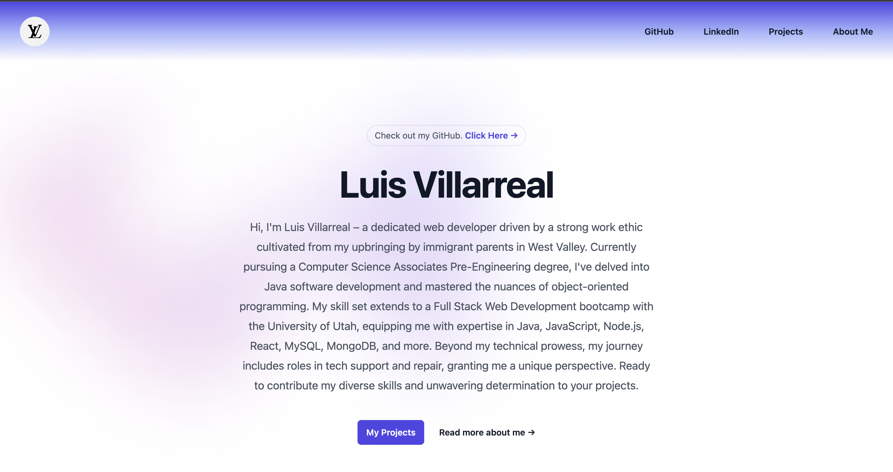

# Web Dev React Portfolio 2023

## Description

Welcome to my Web Dev React Portfolio 2023! This portfolio showcases my journey as a web developer, highlighting my skills, projects, and experiences. Built using React and enhanced with Tailwind CSS, it offers a user-friendly interface to explore my projects and learn more about me.

## Deployed Link

Check out the deployed portfolio: [Web Dev React Portfolio 2023](https://luis6400.github.io/WebDevReactPortfolio2023/)

## Technologies Used

- React
- HTML
- CSS
- Tailwind CSS

## Usage

Feel free to explore the portfolio to learn about my skills, projects, and experiences. You can navigate through different sections to get insights into my journey as a web developer.

## License

This project is licensed under the MIT License - see the [LICENSE](LICENSE) file for details.

## Contact

Connect with me on [GitHub](https://github.com/Luis6400) and [LinkedIn](https://www.linkedin.com/in/luisvillarreal21/).

---
© 2023 Luis Villarreal
